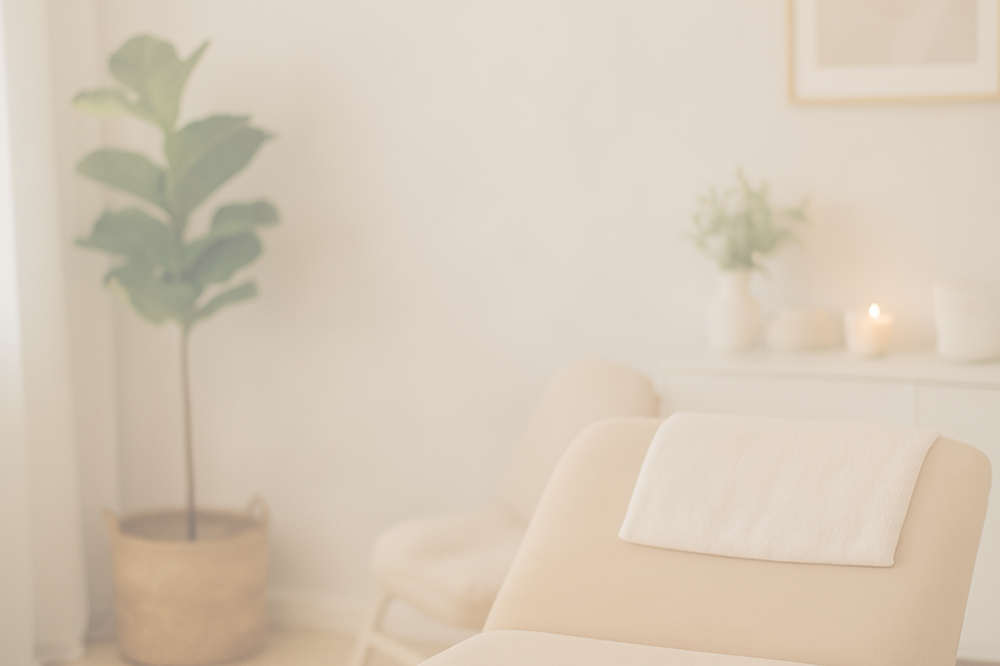

# Salão de Beleza - Landing Page

Este é um projeto de uma landing page para um salão de beleza chamado **RENOVE**, que apresenta os serviços oferecidos, a história do salão, unidades disponíveis e depoimentos de clientes.

## 📂 Estrutura do Projeto

- **index.html**: Contém a estrutura HTML da página.
- **styles.css**: Contém os estilos CSS para a página.
- **img/**: Pasta com as imagens utilizadas no projeto.

## 🚀 Funcionalidades

- **Navegação**: Menu fixo com links para as seções da página.
- **Serviços**: Apresentação dos serviços oferecidos pelo salão.
- **Nossa História**: Uma seção dedicada à história do salão.
- **Unidades**: Informações sobre as unidades disponíveis.
- **Depoimentos**: Depoimentos de clientes satisfeitos.
- **Footer**: Links para redes sociais e informações adicionais.

## 🖼️ Prévia do Projeto

### Header


### Serviços


### Unidades


## 🎨 Tecnologias Utilizadas

- **HTML5**: Para a estrutura da página.
- **CSS3**: Para estilização e responsividade.
- **Remixicon**: Ícones utilizados no projeto.
- **Google Fonts**: Fonte "Poppins" para tipografia.

## 📦 Como Usar

1. Clone o repositório:
   ```bash
   git clone https://github.com/seu-usuario/salao-landing.git

   📱 Responsividade
O projeto foi desenvolvido com design responsivo, garantindo uma boa experiência em dispositivos móveis e desktops.